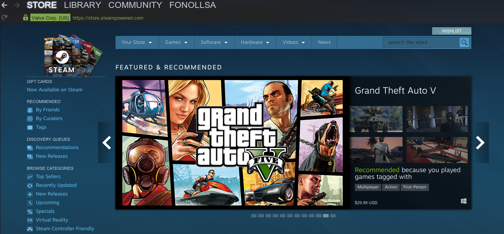

# Video-Games Recommendation Sysetm 

Machine Learning Nano-degree Capstone Project

## Intro

This project presents a video-games recommender system anticipated to be used by a community of gamers players or game centers. This system filters out or evaluate games through the opinions of other similar gamers using collaborative filtering technique in deep learning and suggest those to the intended user.

### Data Source
[Steam game recommendations dataset](https://www.kaggle.com/danieloehm/steam-game-recommendations/data)

## Prerequisites and Installing

```
pip install requirements.txt
```
